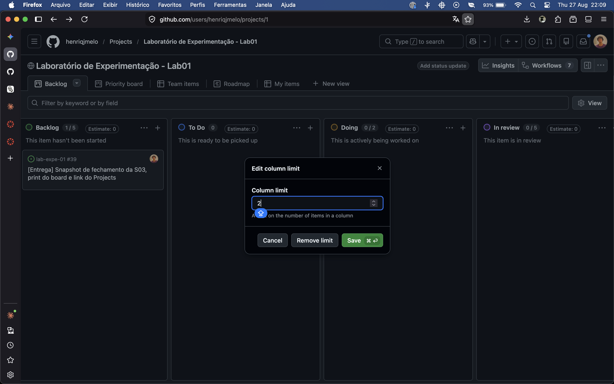

# Relatorio: caracteristicas de repositorios populares

## 1. Introducao e hipoteses

Este estudo analisa um conjunto de 990 repositorios publicos com maior numero de estrelas no GitHub. O objetivo e observar sinais de maturidade, atividade de contribuicao, frequencia de atualizacao, linguagens predominantes e tratamento de issues.

As hipoteses informais usadas para orientar a analise foram:

- **Issue #10 (RQ01/RQ02):** repositorios mais antigos tendem a acumular mais pull requests aceitos, pois tiveram mais tempo para receber contribuicoes externas.
- **Issue #11 (RQ03/RQ04):** repositorios populares permanecem ativos, com atualizacoes recentes, mas a frequencia de releases pode variar conforme o tipo de projeto e seu processo de versionamento.
- **Issue #12 (RQ05/RQ06):** as linguagens primarias mais frequentes devem acompanhar linguagens populares no ecossistema, e repositorios populares devem apresentar uma proporcao elevada de issues fechadas.

As hipoteses sao direcionadoras e nao implicam causalidade. A popularidade foi operacionalizada pelo numero de estrelas, e o recorte observado representa o estado do dataset coletado, nao uma amostra aleatoria de todos os projetos do GitHub.

## 2. Metodologia de coleta

Os dados foram coletados por meio da API GraphQL oficial do GitHub, usando `requests` e consultas GraphQL manuais. A consulta unificada busca repositorios por `stars:>1 sort:stars-desc` e pagina os resultados ate formar o conjunto analisado.

Para cada repositorio foram coletados:

- `nameWithOwner` e `stargazerCount`;
- `createdAt` e `pushedAt`;
- pull requests com estado `MERGED`;
- total de releases publicadas;
- `primaryLanguage`;
- issues fechadas e total de issues.

O resultado foi armazenado em `data/repositorios.csv`. As validacoes usam somente a biblioteca padrao do Python: verificam valores nulos, limites e inconsistencias basicas. Outliers numericos sao identificados pelo limite superior do intervalo interquartil (IQR), calculado como `Q3 + 1,5 * IQR`. Datas sao convertidas para objetos com fuso UTC antes da verificacao.

A validacao do dataset encontrou 990 repositorios, sem nulos em `createdAt` e `pullRequests`. Foram identificados 123 outliers em pull requests aceitos. Em RQ05, 85 repositorios nao possuem linguagem primaria informada. Em RQ06, a mediana da razao de issues fechadas foi 0,8751; 42 repositorios possuem zero issues totais, e nenhum apresentou mais issues fechadas que issues totais.

## 3. Resultados e discussao por RQ

A analise usa como data de referencia o `pushedAt` mais recente do dataset, 21/08/2026, que corresponde ao momento da coleta. Usar a data corrente faria os valores de idade e de tempo sem atualizacao mudarem a cada execucao do script.

### RQ01 — Sistemas populares sao maduros/antigos?

Metrica: idade do repositorio em anos, a partir de `createdAt`.

| Estatistica | Valor |
| :--- | ---: |
| Mediana | 7,7 anos |
| Media | 7,6 anos |
| Minimo | 0,0 ano |
| Maximo | 18,4 anos |
| Q1 | 3,5 anos |
| Q3 | 11,3 anos |

Distribuicao por faixa:

| Faixa | Repositorios | Percentual |
| :--- | ---: | ---: |
| Menos de 5 anos | 322 | 32,5% |
| De 5 a 10 anos | 328 | 33,1% |
| De 10 a 15 anos | 291 | 29,4% |
| 15 anos ou mais | 49 | 4,9% |

Grafico: `graficos/rq01_idade.png`.

**Discussao.** A mediana de 7,7 anos indica que os repositorios mais populares tendem a ser projetos ja estabelecidos, e nao lancamentos recentes. Cerca de dois tercos da amostra tem 5 anos ou mais. Ainda assim, a resposta nao e absoluta: um terco dos repositorios tem menos de 5 anos, o que mostra que ganhar volume de estrelas nao depende necessariamente de muito tempo de existencia. O maximo de 18,4 anos e coerente com o limite da propria plataforma, que foi lancada em 2008.

### RQ02 — Sistemas populares recebem muita contribuicao externa?

Metrica: total de pull requests aceitas, no estado `MERGED`.

| Estatistica | Valor |
| :--- | ---: |
| Mediana | 768 |
| Media | 4.259 |
| Minimo | 0 |
| Maximo | 103.403 |
| Q1 | 175 |
| Q3 | 3.426 |

Vinte repositorios nao possuem nenhuma pull request aceita.

Grafico: `graficos/rq02_pull_requests.png`. O histograma usa intervalos e eixo horizontal em escala logaritmica, porque a distribuicao vai de zero a mais de cem mil e, em escala linear, quase toda a amostra se concentraria na primeira barra. Os vinte repositorios sem nenhuma PR aceita ficam fora do grafico, ja que nao ha logaritmo de zero, mas continuam contabilizados na tabela.

**Discussao.** A distancia entre mediana e media, 768 contra 4.259, mostra que a contribuicao externa e bastante concentrada: um grupo pequeno de projetos acumula um volume muito alto de PRs aceitas e puxa a media para cima, enquanto metade da amostra fica abaixo de 768. A resposta a RQ depende de onde se olha. Em termos medianos, o volume de contribuicao e expressivo, mas dizer que sistemas populares em geral recebem muita contribuicao externa esconde a assimetria da distribuicao.

### RQ01 e RQ02 — hipotese versus resultado

A hipotese informal registrada na issue #10 dizia que repositorios mais antigos tendem a acumular mais pull requests aceitas, por terem tido mais tempo de receber contribuicoes externas. Cruzando as duas metricas por faixa de idade:

| Faixa de idade | Repositorios | Mediana de PRs aceitas |
| :--- | ---: | ---: |
| Menos de 5 anos | 322 | 453 |
| De 5 a 10 anos | 328 | 778 |
| De 10 a 15 anos | 291 | 1.067 |
| 15 anos ou mais | 49 | 1.740 |

O resultado acompanha a hipotese: a mediana de PRs aceitas cresce em todas as faixas conforme a idade aumenta, sem excecao. Cabem duas ressalvas. A primeira e que o crescimento nao e proporcional ao tempo: entre a faixa mais nova e a mais antiga a idade se multiplica bem mais do que as 3,8 vezes observadas na mediana de PRs, o que sugere que o tempo explica parte do fenomeno, mas nao ele todo. A segunda e que o cruzamento mostra associacao, nao causa. Fatores como o tipo de projeto, o tamanho da comunidade e a politica de contribuicao de cada repositorio nao foram controlados e podem estar por tras do mesmo padrao.

### RQ03 — Sistemas populares lancam releases com frequencia?

Metrica: total de releases publicadas.

| Estatistica | Valor |
| :--- | ---: |
| Mediana | 38 releases |
| Media | 127 releases |
| Minimo | 0 releases |
| Maximo observado | 1.000 releases |
| Q1 | 0 releases |
| Q3 | 147 releases |

Dos 990 repositorios, 288 nao possuem nenhuma release e 23 aparecem exatamente no teto de 1.000 da API. Nesse segundo grupo, o valor real pode ser maior, pois `releases.totalCount` e truncado pela API nesse limite. O grafico `graficos/rq03_releases.png` mostra a distribuicao dos repositorios com pelo menos uma release, mantendo os dois grupos explicitamente informados no titulo e no texto.

**Discussao.** A hipotese da issue #11 dizia que a frequencia de releases varia conforme o tipo de projeto e seu processo de versionamento. O resultado apoia essa leitura: embora a mediana seja 38, quase 29% do conjunto nao publica releases. Isso inclui listas curadas, material de referencia e outros repositorios que nao seguem um ciclo tradicional de versoes. A media de 127 tambem fica muito acima da mediana por causa de poucos projetos com muitas releases. O teto da API limita a leitura dos extremos e exige cautela ao comparar os maiores produtores de releases.

### RQ04 — Sistemas populares sao atualizados com frequencia?

Metrica: tempo, em dias, entre o `pushedAt` e a data de referencia da coleta, 21/08/2026.

| Estatistica | Valor |
| :--- | ---: |
| Mediana | 1 dia |
| Media | 112 dias |
| Minimo | 0 dias |
| Maximo | 2.452 dias |
| Q1 | 0 dias |
| Q3 | 47 dias |

Quatrocentos e quarenta e seis repositorios tiveram push no proprio dia da coleta. O grafico `graficos/rq04_dias_sem_push.png` apresenta a distribuicao do tempo ate a ultima atualizacao.

**Discussao.** A mediana de apenas 1 dia confirma a parte da hipotese que previa atualizacoes recentes: pelo menos metade dos repositorios foi atualizada ha no maximo um dia antes da referencia. A media de 112 dias e o terceiro quartil de 47 dias revelam uma cauda longa de repositorios populares que nao recebem mudancas ha meses ou anos. Portanto, a amostra e predominantemente ativa, mas nao homogenea; a frequencia de atualizacao varia conforme o projeto e seu ritmo de manutencao.

### RQ05 — Sistemas populares sao escritos nas linguagens mais populares?

Metrica: linguagem primaria do repositorio, campo `primaryLanguage`.

Dos 990 repositorios, 85 nao tem linguagem primaria informada e ficam fora da contagem. Os 905 restantes se distribuem em 43 linguagens distintas.

Contagem por categoria, dez linguagens mais frequentes:

| Linguagem primaria | Repositorios | Percentual dos 905 |
| :--- | ---: | ---: |
| Python | 227 | 25,1% |
| TypeScript | 171 | 18,9% |
| JavaScript | 109 | 12,0% |
| Go | 77 | 8,5% |
| Rust | 57 | 6,3% |
| C++ | 40 | 4,4% |
| Java | 40 | 4,4% |
| Jupyter Notebook | 23 | 2,5% |
| C | 21 | 2,3% |
| Shell | 20 | 2,2% |

Grafico: `graficos/rq05_linguagens.png`, com as 15 linguagens mais frequentes. Os 85 repositorios sem linguagem primaria ficam fora do grafico, porque nao formam uma linguagem e apareceriam como uma categoria que nao existe; o numero continua reportado no texto e no titulo da figura.

**Comparacao com a fonte de referencia.** A RQ nao pergunta quais linguagens aparecem no dataset, e sim se elas sao as mais populares segundo uma fonte externa. As fontes declaradas no README sao o GitHub Octoverse 2025, por contribuidores ativos, e o TIOBE Index de agosto/2026. As duas listas ficam fixas em `src/analysis/rq05_rq06.py`, com a data da consulta, para manter a analise reproduzivel.

| Linguagem | Posicao no dataset | Repositorios | Octoverse | TIOBE |
| :--- | ---: | ---: | ---: | ---: |
| Python | 1 | 227 | 2 | 1 |
| TypeScript | 2 | 171 | 1 | — |
| JavaScript | 3 | 109 | 3 | 6 |
| Go | 4 | 77 | 10 | — |
| Rust | 5 | 57 | — | 10 |
| C++ | 6 | 40 | 8 | 3 |
| Java | 7 | 40 | 4 | 4 |
| Jupyter Notebook | 8 | 23 | — | — |
| C | 9 | 21 | — | 2 |
| Shell | 10 | 20 | 7 | — |

| Referencia | Repositorios em linguagens do top 10 | Percentual dos 905 | Linguagens do top 10 ausentes do dataset |
| :--- | ---: | ---: | :--- |
| Octoverse 2025 | 696 | 76,9% | HCL |
| TIOBE agosto/2026 | 502 | 55,5% | Visual Basic, SQL, R |
| Presentes nos dois rankings | 424 | 46,9% | — |

**Discussao.** A hipotese informal da issue #12 dizia que as linguagens primarias mais frequentes deveriam acompanhar as linguagens populares do ecossistema. Houve coincidencia, mas ela depende da fonte de referencia adotada.

Em relacao ao Octoverse a hipotese se confirma com folga: 76,9% dos repositorios com linguagem estao em alguma das dez linguagens do ranking, as quatro primeiras posicoes do dataset (Python, TypeScript, JavaScript e Go) estao todas no top 10, e a unica linguagem do ranking sem nenhum repositorio no dataset e HCL, ligada a arquivos de infraestrutura e nao a projetos de biblioteca ou aplicacao.

Em relacao ao TIOBE a coincidencia e apenas parcial: 55,5%, com tres linguagens do top 10 sem nenhum repositorio no dataset (Visual Basic, SQL e R) e com duas das linguagens mais frequentes aqui, TypeScript em 2o e Go em 4o, ausentes do ranking. A explicacao mais direta e que as duas fontes medem coisas diferentes: o Octoverse mede atividade dentro do proprio GitHub, o mesmo universo de onde o dataset foi extraido, enquanto o TIOBE estima uso na industria em geral, incluindo software que nao vive em repositorio publico. O nucleo comum aos dois rankings, formado por Python, JavaScript, Java, C# e C++, cobre 46,9% do dataset.

Ou seja: repositorios populares sao majoritariamente escritos em linguagens populares, desde que "popular" seja medido no proprio ecossistema de codigo aberto. A afirmacao enfraquece quando a referencia e um indice de mercado mais amplo.

### RQ06 — Sistemas populares possuem um alto percentual de issues fechadas?

Metrica: razao entre issues fechadas e total de issues.

Os 42 repositorios sem nenhuma issue ficam fora do calculo, porque a razao nao existe para eles. Conta-los como zero puxaria a mediana para baixo sem que houvesse issue aberta alguma. Restam 948 repositorios.

| Estatistica | Valor |
| :--- | ---: |
| Mediana | 0,8751 |
| Media | 0,8027 |
| Minimo | 0,0769 |
| Maximo | 1,0000 |
| Q1 | 0,7042 |
| Q3 | 0,9683 |

Contagem por categoria:

| Faixa da razao | Repositorios | Percentual dos 948 |
| :--- | ---: | ---: |
| Abaixo de 0,50 | 107 | 11,3% |
| De 0,50 a 0,75 | 168 | 17,7% |
| De 0,75 a 0,90 | 247 | 26,1% |
| 0,90 ou mais | 426 | 44,9% |

Vinte e oito repositorios tem 100% das issues fechadas.

Grafico: `graficos/rq06_razao_issues.png`.

**Discussao.** A hipotese da issue #12 tambem previa uma proporcao elevada de issues fechadas, e o resultado a confirma: a mediana e 0,8751 e 71,0% dos repositorios estao acima de 0,75. Metade da amostra fecha quase nove de cada dez issues abertas.

Duas ressalvas. A primeira e que a media, 0,8027, fica abaixo da mediana, o inverso do que ocorre em RQ02: aqui a cauda longa esta a esquerda, formada pelos 107 repositorios (11,3%) com menos da metade das issues fechadas. A distribuicao e alta e concentrada, mas nao uniforme. A segunda e que a metrica mede estado acumulado, nao processo: um repositorio pode ter razao alta por manutencao ativa ou por fechar issues antigas em massa sem resolve-las. A razao nao diz quanto tempo uma issue leva para ser fechada nem se a solucao foi adequada.

### RQ05 e RQ06 — hipotese versus resultado

A hipotese da issue #12 juntava as duas RQs, o que sugere verificar se o percentual de fechamento depende do ecossistema da linguagem. Mediana da razao de issues fechadas nas dez linguagens mais frequentes:

| Linguagem primaria | Repositorios com issues | Mediana da razao |
| :--- | ---: | ---: |
| TypeScript | 170 | 0,9223 |
| Go | 76 | 0,9190 |
| Shell | 20 | 0,9161 |
| JavaScript | 108 | 0,9010 |
| Java | 39 | 0,8877 |
| C++ | 40 | 0,8516 |
| Python | 219 | 0,8494 |
| Rust | 57 | 0,8224 |
| C | 17 | 0,8220 |
| Jupyter Notebook | 23 | 0,6538 |

Nove das dez linguagens ficam num intervalo estreito, entre 0,82 e 0,93, e todas acima da faixa que a RQ06 chamaria de percentual elevado. A unica fora do padrao e Jupyter Notebook, com 0,6538, coerente com o perfil dessa categoria: sao em boa parte colecoes de material didatico e de exemplos, onde issues tendem a ficar abertas por falta de manutencao continua, e nao projetos de software com ciclo de correcao.

O que isso mostra e que o alto percentual de issues fechadas e caracteristica do conjunto de repositorios populares, e nao de uma linguagem especifica. As contagens de repositorios com issues diferem das da RQ05 porque os repositorios sem nenhuma issue saem do calculo — em C, por exemplo, 17 dos 21.

### RQ07 (bonus) — Sistemas escritos nas linguagens mais populares recebem mais contribuicao externa, lancam mais releases e sao atualizados com mais frequencia?

A RQ07 nao tem metrica propria: cruza as metricas ja definidas em RQ02 (pull requests aceitas), RQ03 (releases publicadas) e RQ04 (dias ate a ultima atualizacao), agrupadas pela linguagem primaria da RQ05.

**Corte minimo de repositorios por linguagem.** A comparacao so inclui linguagens com pelo menos 10 repositorios. Das 43 linguagens primarias do dataset, 24 aparecem em menos de 5 repositorios e 12 aparecem em um unico: nesses casos a mediana descreve dois ou tres projetos especificos, nao a linguagem, e comparar isso com Python, que tem 227 repositorios, nao informa nada. O valor 10 tambem cai num intervalo vazio da distribuicao — Swift tem 10 repositorios e Kotlin, a linguagem seguinte, tem 9 —, entao o corte nao parte ao meio um grupo de linguagens equivalentes. Sobram 13 linguagens, que cobrem 819 dos 905 repositorios com linguagem informada (90,5%).

O corte tem um custo que precisa ficar registrado: ele derruba C# (8 repositorios) e PHP (4), que estao no top 10 das proprias fontes de referencia. A leitura abaixo, portanto, compara linguagens populares que sao populares tambem dentro deste dataset.

Mediana por linguagem nas tres metricas, com Q1 e Q3:

| Linguagem | n | PRs aceitas (Q1 / mediana / Q3) | Releases (Q1 / mediana / Q3) | Dias sem push (Q1 / mediana / Q3) |
| :--- | ---: | ---: | ---: | ---: |
| Python | 227 | 106 / 560 / 2.345 | 0 / 20 / 103 | 0 / 2 / 56 |
| TypeScript | 171 | 629 / 2.032 / 6.485 | 35 / 133 / 344 | 0 / 0 / 6 |
| JavaScript | 109 | 196 / 617 / 1.612 | 0 / 37 / 154 | 0 / 3 / 98 |
| Go | 77 | 666 / 1.958 / 5.340 | 59 / 142 / 284 | 0 / 0 / 11 |
| Rust | 57 | 934 / 2.212 / 6.060 | 40 / 90 / 174 | 0 / 0 / 4 |
| C++ | 40 | 434 / 1.123 / 9.784 | 12 / 46 / 121 | 0 / 0 / 10 |
| Java | 40 | 144 / 832 / 4.082 | 2 / 57 / 116 | 0 / 2 / 66 |
| Jupyter Notebook | 23 | 19 / 88 / 496 | 0 / 0 / 0 | 1 / 24 / 314 |
| C | 21 | 14 / 294 / 3.398 | 0 / 46 / 106 | 0 / 0 / 16 |
| Shell | 20 | 129 / 390 / 1.063 | 0 / 6 / 71 | 1 / 14 / 76 |
| Ruby | 13 | 1.046 / 6.269 / 17.956 | 0 / 28 / 264 | 0 / 2 / 204 |
| HTML | 11 | 153 / 232 / 319 | 0 / 0 / 0 | 0 / 32 / 212 |
| Swift | 10 | 414 / 704 / 1.498 | 19 / 38 / 112 | 0 / 2 / 16 |

Em dias sem push, menos e melhor: o valor mede quanto tempo o repositorio ficou parado ate a data de referencia, entao mediana menor significa atualizacao mais frequente.

Graficos, um por metrica: `graficos/rq07_pull_requests.png`, `graficos/rq07_releases.png` e `graficos/rq07_dias_sem_push.png`. Os tres sao boxplots por linguagem, e nao barras de media, porque as tres metricas tem distribuicao muito assimetrica — a media seria puxada por poucos projetos gigantes e esconderia a dispersao, que aqui e justamente o que interessa comparar. O eixo vertical usa escala symlog: as tres metricas contem zeros legitimos (repositorios sem release, sem PR aceita ou com push no proprio dia da coleta), que sumiriam numa escala logaritmica comum. Os outliers ficam omitidos, senao as caudas achatariam todas as caixas.

**Linguagens populares contra as demais.** A pergunta da RQ nao e qual linguagem lidera cada metrica, e sim se linguagem popular anda junto com mais atividade. Agrupando as 13 linguagens do recorte segundo cada fonte de referencia:

| Agrupamento | Grupo | n | Mediana de PRs aceitas | Mediana de releases | Mediana de dias sem push |
| :--- | :--- | ---: | ---: | ---: | ---: |
| Octoverse top 10 | populares | 684 | 998 | 59 | 1 |
| Octoverse top 10 | demais | 135 | 775 | 38 | 1 |
| TIOBE top 10 | populares | 494 | 756 | 39 | 1 |
| TIOBE top 10 | demais | 325 | 1.254 | 99 | 0 |
| Nos dois rankings | populares | 416 | 674 | 31 | 2 |
| Nos dois rankings | demais | 403 | 1.448 | 96 | 0 |

Pelo Octoverse, o grupo popular fica a frente em PRs aceitas e em releases, e empata em atualizacao. Pelo TIOBE e pelo nucleo comum aos dois rankings, o resultado se inverte em todas as tres metricas. A causa do sinal trocado e identificavel: TypeScript, Go e Rust estao entre as linguagens mais ativas do dataset e caem no grupo "demais" segundo o TIOBE, que nao lista nenhuma das tres no top 10.

**Vies do truncamento de releases.** A comparacao de releases por linguagem herda o limite descrito na secao 5: a API do GitHub nao devolve mais de 1000 em `releases.totalCount`, e 23 dos 990 repositorios (2,3%) estao nesse teto com a contagem truncada. Eles nao se distribuem por igual:

| Linguagem | Repositorios | Truncados | Percentual da linguagem |
| :--- | ---: | ---: | ---: |
| TypeScript | 171 | 10 | 5,8% |
| Rust | 57 | 3 | 5,3% |
| C++ | 40 | 2 | 5,0% |
| Python | 227 | 5 | 2,2% |
| JavaScript | 109 | 2 | 1,8% |
| Go | 77 | 1 | 1,3% |

TypeScript e JavaScript concentram 12 dos 23 truncados (52,2%), enquanto respondem por 30,9% dos repositorios com linguagem. O efeito e que a mediana e o Q3 de releases desse ecossistema estao subestimados em relacao ao valor real, entao a posicao de TypeScript no ranking de releases e um piso, nao um teto. Dentro do ecossistema, o efeito vem quase todo do TypeScript: JavaScript sozinho tem so 2 repositorios truncados, 1,8% do seu grupo.

**Discussao.** A RQ07 e bonus e nao tem hipotese propria registrada na S02. A extensao natural da hipotese da issue #12 seria esperar que linguagem popular andasse junto com mais contribuicao, mais releases e atualizacao mais frequente. O resultado nao sustenta essa extensao.

O primeiro motivo e que a resposta muda conforme a fonte de referencia, como a tabela acima mostra: confirma pelo Octoverse, inverte pelo TIOBE. Uma conclusao que troca de sinal ao trocar a lista de referencia nao pode ser apresentada como resposta da RQ.

O segundo motivo e que a linguagem, isoladamente, nao parece ser o fator determinante. Python e a linguagem mais frequente do dataset, esta no top 10 das duas fontes e ainda assim aparece com mediana de 560 PRs aceitas e 20 releases, abaixo de Rust (2.212 e 90) e de Go (1.958 e 142), que nao ocupam as primeiras posicoes em nenhuma das duas listas. Ruby, com 13 repositorios e fora dos dois rankings, tem a maior mediana de PRs aceitas de todo o recorte, 6.269. O que essas linguagens tem em comum nao e popularidade de ranking, e sim o tipo de projeto: seus repositorios populares tendem a ser ferramentas de infraestrutura e frameworks com ciclo de release automatizado, enquanto boa parte dos repositorios Python mais estrelados sao colecoes de material de estudo, listas e projetos de aprendizado, que recebem poucas PRs e nao publicam release nenhuma. Sao 60 dos 227 repositorios Python (26,4%) com zero releases, o que aparece como Q1 igual a zero na tabela; entre os mais estrelados desse grupo estao `public-apis/public-apis`, `EbookFoundation/free-programming-books`, `donnemartin/system-design-primer` e `vinta/awesome-python`, nenhum deles um projeto de software com ciclo de versao.

Isso fica mais claro no extremo da tabela: Jupyter Notebook e HTML tem mediana zero de releases, as duas maiores medianas de dias sem push (24 e 32) e as duas menores medianas de PRs aceitas. Sao justamente as categorias com maior proporcao de conteudo, e nao de software mantido.

A resposta possivel, portanto, e negativa com ressalva: nao ha evidencia de que escrever em linguagem popular, por si so, implique mais contribuicao externa, mais releases ou atualizacao mais frequente. O padrao observado se alinha melhor ao proposito do repositorio do que a popularidade da linguagem. Como em RQ01 e RQ02, o cruzamento mostra associacao e nao causa, e nenhum outro fator — idade, tamanho da comunidade, presenca de mantenedor corporativo — foi controlado.

## 4. Configuracao do processo

- **Repositorio:** https://github.com/henriqjmelo/lab-expe-01
- **GitHub Projects (v2):** https://github.com/users/henriqjmelo/projects/1

O trabalho foi organizado em issues independentes, com uma branch por entrega e commits iniciados pelo numero da issue. O fluxo adotado foi:

`Backlog -> To Do -> Doing -> In Review -> Done`

Cada issue deve ser vinculada ao GitHub Projects v2. Ao iniciar uma tarefa, seu card deve ser movido para `Doing`; apos a revisao e o merge, deve ser movido para `Done`.

### Politica de limite de WIP

O limite de trabalho em andamento na coluna `Doing` foi definido em **2 cartoes**, valor visivel nos prints anexados ao final desta secao.

O grupo tem tres integrantes, entao o limite fica deliberadamente abaixo do tamanho do time. A escolha segue a ideia central do Kanban de priorizar fluxo em vez de ocupacao: se cada integrante pudesse manter um cartao proprio em andamento, as tres frentes avancariam em paralelo e nada seria concluido antes do fim da sprint. Com o teto em 2, quem termina uma tarefa e encontra o limite ocupado precisa ajudar a fechar ou revisar o que ja esta em andamento antes de puxar item novo, o que reduz o tempo de ciclo e evita acumular trabalho pela metade.

O efeito pratico apareceu na organizacao das sprints: as entregas foram encadeadas por dependencia, com a base de analise liberando as analises por RQ, e cada analise liberando a secao correspondente do relatorio.

As colunas `Backlog` e `In review` tambem receberam limite, de 5 cartoes cada, para sinalizar acumulo nas pontas do fluxo.

As consultas do GitHub usam exclusivamente `requests` e GraphQL manual. Nao foram utilizadas bibliotecas de terceiros para a API do GitHub. `matplotlib` e `numpy` entram apenas na etapa de analise e visualizacao, e nao acessam a API. O token e carregado por `GITHUB_TOKEN` a partir do ambiente ou de `.env`, que permanece fora do controle de versao.

## 5. Limites da analise

A contagem de releases (RQ03) e truncada pela propria API do GitHub, que nao retorna valores acima de 1000 em `releases.totalCount`. No dataset, 23 dos 990 repositorios (2,3%) aparecem com exatamente 1000 releases, o que significa que o total real deles e maior — nao foi possivel saber quanto. A verificacao foi feita consultando `repository(...)` diretamente, fora da busca paginada: `vercel/next.js`, `electron/electron` e `home-assistant/core` retornam exatamente 1000, enquanto `facebook/react` retorna 132, um valor real abaixo do teto. A mediana de RQ03 nao e afetada, ja que a maior parte da distribuicao esta longe do limite, mas o valor maximo e a analise de extremos ficam subestimados. Esse truncamento tambem tende a enviesar a RQ07 na comparacao de releases por linguagem, porque os projetos que batem no teto se concentram no ecossistema JavaScript/TypeScript.

A coleta reuniu 990 repositorios em vez dos 1000 previstos pelo enunciado. A diferenca vem do proprio ranking mudando durante os minutos que a paginacao leva pra terminar: como a busca e ordenada por estrelas em tempo real, repositorios podem entrar ou sair das primeiras posicoes entre uma pagina e outra. O numero se repetiu (990) em duas coletas separadas, o que sugere um limite proprio da API pra essa consulta, nao uma falha aleatoria.

O ranking e dinamico e pode mudar durante a coleta. Campos nulos, especialmente `primaryLanguage`, podem refletir repositorios sem linguagem dominante definida pelo GitHub. Outliers nao sao erros automaticamente: projetos muito grandes podem legitimamente concentrar contribuicoes ou issues. Por fim, a razao de issues fechadas nao mede tempo de resolucao nem qualidade da manutencao.
