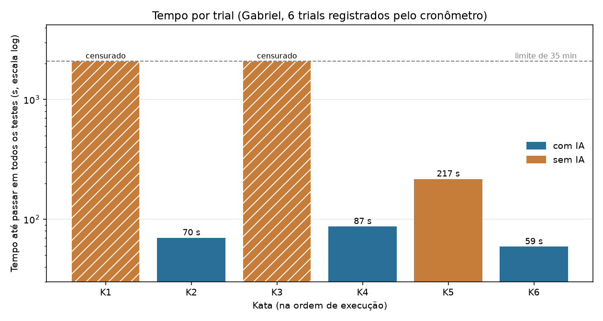
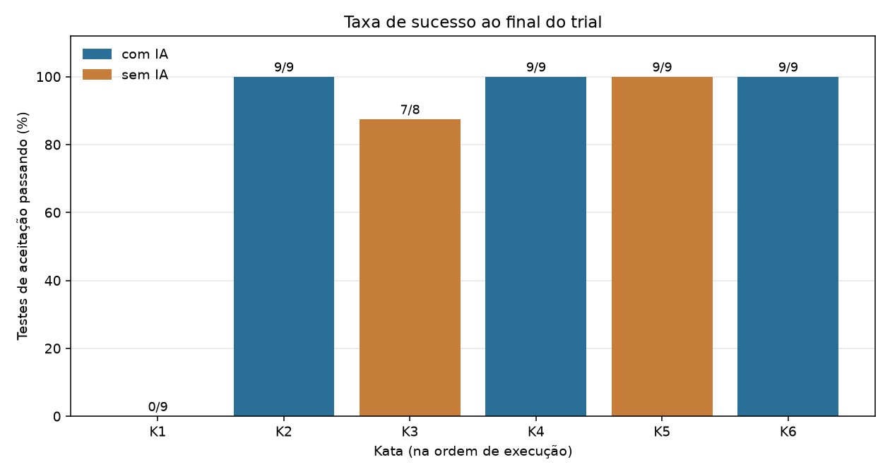
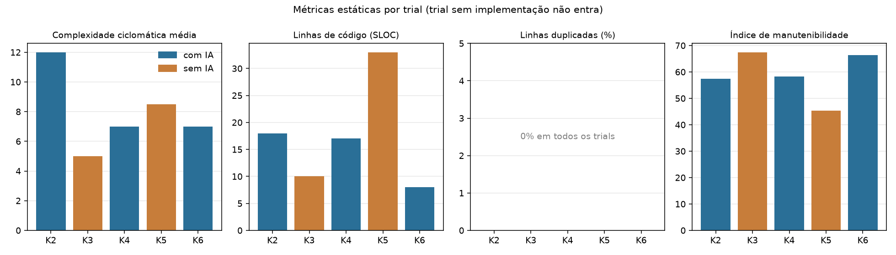

# Assistentes de IA vs. codificação manual: um experimento controlado

**Laboratório 02 · Laboratório de Experimentação de Software**
Engenharia de Software, 6º período, noite · Professor: Danilo Maia

**Integrantes**

* Guilherme Augustto Costa Barros
* Gabriel Afonso Infante Vieira
* Henrique Jardim

**Repositório:** https://github.com/henriqjmelo/lab-expe-01
**GitHub Projects (v2):** https://github.com/users/henriqjmelo/projects/1

---

## Estado desta versão

O experimento foi planejado para 18 trials (3 participantes, 6 katas cada). Nesta versão do relatório, **6 dos 18 trials estão registrados pelo cronômetro** em `data/trials_raw.csv`, todos do Gabriel. Os trials do Guilherme (issues #66 a #71) e do Henrique (#78 a #83) não têm registro do cronômetro e por isso **não entram na análise**.

Com 6 trials, de um único participante, e com katas diferentes em cada tratamento, não existem pares válidos para o teste de Wilcoxon. Esta versão traz só estatística descritiva e não responde às três questões de pesquisa. As seções 3 e 4 mostram o que os dados registrados permitem observar, e a seção 5 lista o que limita essa leitura. Todos os números vêm do script `src/analise_parcial.py`, que pode ser executado de novo quando os demais trials forem registrados. Nenhum valor foi estimado ou preenchido por dedução.

---

## 1. Introdução e hipóteses

Assistentes de IA generativa entraram no dia a dia de quem programa, mas a maior parte do que se diz sobre o efeito deles em produtividade e qualidade é relato pessoal. Este laboratório mede esse efeito num experimento controlado, com katas de programação resolvidas com e sem um assistente, sob tempo limitado.

O tratamento é o uso do assistente: `com IA`, em que o participante pode consultá-lo, e `sem IA`, em que não pode. As questões e hipóteses (detalhadas em `DESENHO.md`) são:

| Questão | H0 | H1 |
| :--- | :--- | :--- |
| RQ1: a IA reduz o tempo para resolver a tarefa? | A mediana do tempo até passar em todos os testes com IA é igual ou maior que sem IA. | A mediana com IA é menor. |
| RQ2: a IA reduz os defeitos, ou seja, os testes que falham? | A mediana da taxa de testes aprovados com IA é igual ou menor que sem IA. | A mediana com IA é maior. |
| RQ3: a IA altera a complexidade ciclomática ou a duplicação do código? | As medianas de complexidade média e de linhas duplicadas com IA são iguais ou maiores que sem IA. | As medianas com IA são menores. |

Nível de significância planejado: α = 0,05.

---

## 2. Metodologia

### 2.1 Desenho

Desenho crossover com contrabalanceamento entre participantes. Cada participante resolve as seis katas uma vez, três com IA e três sem, o que dá 18 trials e 9 por tratamento. Cada trial tem limite de 35 minutos (2100 s). A ordem planejada de cada pessoa foi congelada antes da coleta:

| Ordem planejada | Guilherme | Gabriel | Henrique |
| :-: | :-- | :-- | :-- |
| 1 | K1 com IA | K1 sem IA | K6 com IA |
| 2 | K2 sem IA | K2 com IA | K5 sem IA |
| 3 | K3 com IA | K3 sem IA | K4 com IA |
| 4 | K4 sem IA | K4 com IA | K3 sem IA |
| 5 | K5 com IA | K5 sem IA | K2 com IA |
| 6 | K6 sem IA | K6 com IA | K1 sem IA |

Como cada pessoa faz cada kata uma única vez, o pareamento da análise final só pode ser feito por kata (seis pares, comparando os trials com IA e sem IA de cada kata entre participantes), e não por participante. O `DESENHO.md` descreve o pareamento como se cada participante repetisse a mesma kata nos dois tratamentos, o que não é possível com 18 trials. Esse ponto deve ser revisado antes da análise final.

### 2.2 Objetos experimentais

Seis katas autorais em Python, escritas para este laboratório, sem cópia de LeetCode, HackerRank ou Codewars, para reduzir a chance de o assistente já conhecer a solução. Cada kata tem uma suíte de aceitação em pytest, congelada antes da coleta (53 testes no total). O piloto de calibração, feito sem IA e fora do dataset, confirmou que as seis cabem no limite de 35 minutos.

| Kata | Tema | Testes |
| :--- | :--- | :-: |
| K1 | Turno de atendimento: distribuição round-robin com capacidade | 9 |
| K2 | Verificador de senha corporativa: validação com sete regras | 9 |
| K3 | Consolidador de notas fiscais: agregação com filtro e arredondamento | 8 |
| K4 | Detector de rajada de login: janela deslizante sobre timestamps | 9 |
| K5 | Compactador de texto por repetição: codificação e decodificação | 9 |
| K6 | Divisor de times por afinidade: partição com algoritmo determinístico | 9 |

### 2.3 Assistente de IA

Claude Sonnet 5 (`claude-sonnet-5`), usado pelo Claude Code na IDE. A regra de uso nos trials com IA é livre: pedir sugestões, implementações completas, correções e explicações de erro. O participante executa a suíte e decide o que aceitar. Nos trials sem IA nenhum assistente pode ser consultado. O protocolo completo, com o que é permitido em cada tratamento, está em `PROTOCOLO.md`.

### 2.4 Ambiente e instrumentação

| Item | Versão fixada no README | Versão usada nos trials do Gabriel |
| :--- | :--- | :--- |
| Python | 3.12.13 | **3.13.0** |
| pytest | 9.1.1 | 9.1.1 |
| radon | 6.0.1 | 6.0.1 |
| jscpd | 5.2.0 | 5.2.0 |
| Node.js | 26.0.0 | **24.13.0** |
| pandas, scipy, matplotlib, seaborn | 3.0.5, 1.18.1, 3.11.1, 0.13.2 | iguais |

As diferenças em Python e Node não afetam a execução dos testes nem as métricas medidas, mas ficam registradas porque o README fixa outras versões.

O tempo e a contagem de testes são registrados pelo `src/timer.py`. Ele copia a kata para uma pasta isolada do trial, marca o início, roda a suíte quando o participante pede e grava uma linha em `data/trials_raw.csv`. O trial termina no primeiro run com todos os testes passando (`censurado = 0`) ou quando chega a 2100 s (`censurado = 1`). O `src/consolida.py` valida o desenho e o `src/metricas.py` mede complexidade e linhas de código com o radon e duplicação com o jscpd, sempre com os mesmos parâmetros (`--min-lines 5 --min-tokens 50`).

### 2.5 Métricas

* **RQ1:** tempo até passar em todos os testes (time-to-green), em segundos. Trial que chega ao limite entra como censurado em 2100 s, nunca é descartado. Agregação por mediana.
* **RQ2:** taxa de sucesso, que é a fração de testes da suíte congelada que passam ao final do trial.
* **RQ3:** complexidade ciclomática média por função (radon `cc`), percentual de linhas duplicadas (jscpd) e, como apoio, índice de manutenibilidade (radon `mi`). O número de linhas (LOC e SLOC) é reportado como variável de controle.

### 2.6 Regras aplicadas nesta análise parcial

* Só entram linhas gravadas pelo cronômetro em `data/trials_raw.csv`.
* O denominador da taxa de sucesso é o tamanho da suíte congelada da kata. Uma verificação final que gravou 0/0 (falha de coleta) é lida como 0 de N.
* Trial sem implementação (o `solucao.py` é idêntico ao esqueleto da kata) fica fora da RQ3, porque não há código para medir.
* Não há teste inferencial. Com n = 3 por tratamento, katas diferentes em cada um e um único participante, a faixa (mínimo e máximo) substitui o IQR.

### 2.7 Como reproduzir

```bash
pip install -r lab-expe-02/requirements.txt
cd lab-expe-02 && npm install
python src/timer.py --integrante <nome> --kata k1 --tratamento sem-ia --ordem 1
python src/consolida.py --parcial
python src/analise_parcial.py
```

Para o experimento completo, depois dos 18 trials: `python src/consolida.py`, `python src/metricas.py --todos` e a análise inferencial descrita na seção 2.1.

---

## 3. Resultados

Trials registrados, do Gabriel. A coluna "Ordem real" é a posição em que o trial foi de fato executado (a coluna "Planejada" é a do contrabalanceamento, gravada como argumento do cronômetro).

| Kata | Tratamento | Planejada | Ordem real | Tempo (s) | Censurado | Testes | Taxa |
| :-: | :-- | :-: | :-: | :-: | :-: | :-: | :-: |
| K1 | sem IA | 1 | 1 | 2100 | sim | 0/9 | 0% |
| K2 | com IA | 2 | 4 | 70 | não | 9/9 | 100% |
| K3 | sem IA | 3 | 2 | 2100 | sim | 7/8 | 87,5% |
| K4 | com IA | 4 | 5 | 87 | não | 9/9 | 100% |
| K5 | sem IA | 5 | 3 | 217 | não | 9/9 | 100% |
| K6 | com IA | 6 | 6 | 59 | não | 9/9 | 100% |



### 3.1 RQ1: tempo

| Tratamento | n | Trials verdes | Censurados | Mediana do tempo | Faixa |
| :--- | :-: | :-: | :-: | :-: | :-: |
| com IA | 3 | 3 | 0 | 70 s | 59 a 87 s |
| sem IA | 3 | 1 | 2 | 2100 s (censurada) | 217 a 2100 s |

A mediana sem IA cai num trial censurado, então ela é um limite inferior: o valor real é de pelo menos 35 minutos. Não é um tempo medido.

### 3.2 RQ2: taxa de sucesso

| Tratamento | n | Mediana da taxa | Faixa |
| :--- | :-: | :-: | :-: |
| com IA | 3 | 100% | 100% |
| sem IA | 3 | 87,5% | 0% a 100% |

Sem IA, o K1 terminou sem nenhuma implementação (0/9) e o K3 terminou com 7 de 8 testes. O teste que faltou no K3 verifica se a mensagem de erro contém a palavra `valor` em minúscula, e a mensagem escrita começava com `Valor`. A validação em si estava correta.



### 3.3 RQ3: estrutura do código

O K1 sem IA não entra, por não ter implementação. Ficam três trials com IA (K2, K4, K6) e dois sem IA (K3, K5).

| Métrica (mediana) | com IA (n=3) | sem IA (n=2) |
| :--- | :-: | :-: |
| Complexidade ciclomática média | 7,0 | 6,75 |
| SLOC | 17 | 21,5 |
| LOC (controle) | 20 | 30 |
| Linhas duplicadas | 0% | 0% |
| Índice de manutenibilidade | 58,3 | 56,4 |

Por trial: complexidade média 12,0 (K2), 5,0 (K3), 7,0 (K4), 8,5 (K5), 7,0 (K6); SLOC 18, 10, 17, 33, 8. A duplicação foi 0% em todos.



---

## 4. Discussão

**O que os números mostram.** Nos três trials com IA, o assistente levou a solução completa a 9/9 testes em 59 a 87 segundos. Sem IA, um trial chegou a 9/9 em 217 s, outro parou em 7 de 8 e o terceiro foi encerrado sem implementação. Isso vai na direção de H1 para RQ1 e RQ2. Para RQ3 não há diferença visível: as medianas são próximas, a duplicação é zero nos dois grupos e com dois trials sem IA uma mediana quase não diz nada.

**Por que isso não responde às questões.** A comparação acima não é uma comparação entre tratamentos, por quatro motivos que se somam:

1. É um único participante, então não existe variação entre pessoas para separar do efeito da IA.
2. As katas são diferentes em cada tratamento (K2, K4, K6 com IA; K1, K3, K5 sem IA). Diferença de dificuldade entre katas fica misturada com o efeito do tratamento, e o piloto de calibração já mostrou tempos de 5 a 30 minutos entre elas.
3. A ordem de execução anulou o contrabalanceamento. Os três trials sem IA foram os três primeiros e os três com IA vieram depois (seção 5). Aprendizado e cansaço aparecem misturados com o tratamento.
4. Com n = 3 por grupo, nenhum teste estatístico tem poder para separar efeito de acaso.

**Sobre o assistente.** O mesmo assistente usado nos trials com IA participou, no Lab02S01, da redação dos enunciados, das suítes de teste e de implementações de referência descartáveis usadas para validar os katas. Como os trials foram feitos na mesma conversa, esse material estava disponível para ele: enunciados, testes e respostas. Isso favorece o tratamento com IA e é o oposto do que o desenho queria, que era usar katas que o assistente não tivesse visto. Os tempos de 59 a 87 s provavelmente subestimam o tempo que o assistente levaria com katas novas.

**Sobre o K1.** O participante encerrou o trial de propósito depois de 101 s, sem escrever código. Pelo protocolo, encerrar antes do limite conta como censurado em 2100 s, e é assim que o registro aparece. É uma decisão do participante, não uma falha de tentativa, e o dado ainda não distingue "não conseguiria" de "não quis continuar".

---

## 5. Limitações e desvios de protocolo

**Cobertura.** 6 de 18 trials registrados. Faltam os 6 do Guilherme e os 6 do Henrique. Os dois conjuntos não têm linha em `data/trials_raw.csv` gerada pelo cronômetro, e as issues #66 a #71 e #78 a #83 seguem abertas.

**Desvios nos trials do Gabriel** (também registrados na seção 6 do `PROTOCOLO.md`):

| Trial | Desvio | Tratamento na análise |
| :--- | :--- | :--- |
| Todos | Ordem real diferente da planejada: K1, K3, K5 (sem IA) e depois K2, K4, K6 (com IA), todos na mesma noite entre 23:03 e 23:30 | Sem correção possível. Confunde tratamento com ordem e cansaço |
| K1 | Antes do trial válido, uma versão com solução já escrita fora da janela de tempo foi colocada na pasta e testada. A linha resultante foi apagada do CSV e o trial foi refeito do zero | Trial válido é o refeito. O kata já era conhecido, então há efeito de aprendizado residual |
| K1 | Verificação final gravou 0/0 testes | Lido como 0 de 9 (o primeiro run do log mostra 0/9) |
| K2, K4, K5 | O `x` gravou censurado em 2100 s sobre um resultado que já estava verde, porque o cronômetro tinha esse defeito. Os tempos reais (70, 87 e 217 s) foram restaurados a partir do `trial_log.txt`, e a suíte foi reexecutada de forma independente para confirmar 9/9 | Correção manual anotada em `correcao_manual` no `trial.json`. O defeito foi corrigido depois no `timer.py` (issue #61) |
| K2, K4, K6 | O assistente escreveu a solução direto no arquivo do trial, em vez de o participante colar a sugestão | O tempo mede o ciclo "pedir, receber, testar" |
| K4, K6 | Além de escrever, o assistente executou a suíte por conta própria antes de o participante pedir o teste no cronômetro | A verificação do assistente não entra no tempo registrado |
| K2, K4, K6 | Os trials foram conduzidos na mesma conversa em que o assistente escreveu os katas e as suítes (ver seção 4) | Ameaça de contaminação, sem correção possível |
| Todos | O protocolo operacional (#84) foi escrito depois desses trials | Condições verificadas retroativamente |

**Outras limitações.**
* `n_prompts` não foi registrado nos trials com IA.
* Python 3.13.0 e Node 24.13.0 em vez das versões fixadas (seção 2.4).
* As ameaças gerais (aprendizado, familiaridade com a ferramenta, memorização pelo modelo, validade externa) estão em `DESENHO.md`, seção 5, e continuam valendo.

---

## 6. Conclusão e próximos passos

Com os dados registrados até aqui, o experimento não permite concluir nada sobre RQ1, RQ2 ou RQ3. O que existe é um conjunto de seis trials bem documentados, com desvios anotados, e a infraestrutura pronta para receber o restante.

Para fechar o experimento:

1. Registrar pelo cronômetro os 12 trials que faltam (Guilherme e Henrique), respeitando a ordem planejada e as regras de isolamento do protocolo.
2. Rodar `consolida.py` para validar o desenho, `metricas.py --todos` e `analise_parcial.py` sobre os 18.
3. Definir o pareamento por kata (seção 2.1) e aplicar o Wilcoxon: RQ1 e RQ2 unilaterais, RQ3 conforme as hipóteses. Com 6 pares, o menor p-valor possível é 0,031 (bilateral).
4. Se o assistente for o mesmo que escreveu os katas, repetir a discussão da contaminação com os dados completos, ou trocar por katas novas nos trials restantes.
5. Atualizar as seções 3 a 5 deste relatório e a apresentação com os resultados finais.

---

## Anexos

* Dados: `data/trials_raw.csv`, `data/analise_parcial_trials.csv`, `data/analise_parcial_tratamentos.csv`
* Código: `src/timer.py`, `src/consolida.py`, `src/metricas.py`, `src/analise_parcial.py`
* Protocolo e desenho: `PROTOCOLO.md`, `DESENHO.md`
* Board: https://github.com/users/henriqjmelo/projects/1
